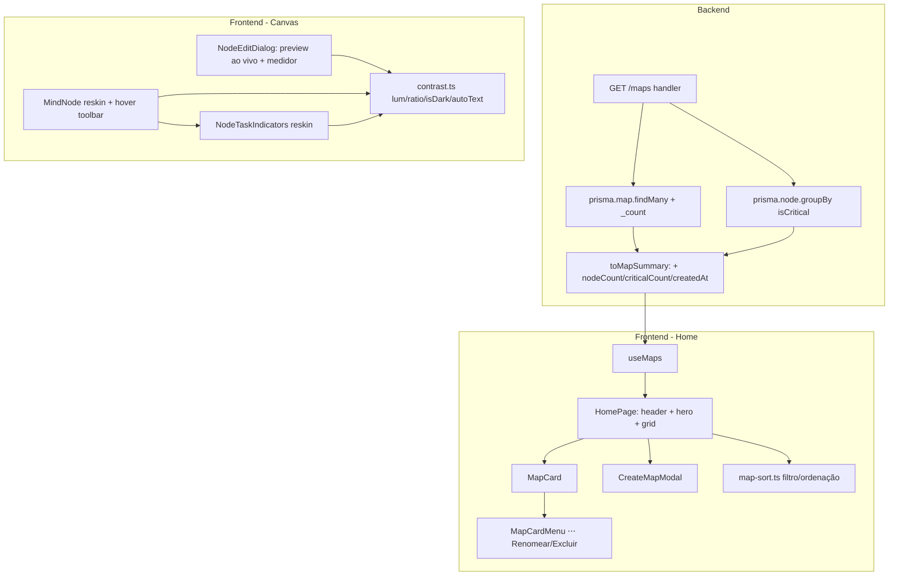

# M10 — Redesign (web) Design

**Spec**: `.specs/features/m10-redesign/spec.md`
**Status**: Executado (M10, 2026-06-25) — pendente review AD-013

---

## Architecture Overview

Reskin de duas telas + **uma** extensão de contrato de API. Nenhuma mudança de schema, layout do canvas ou modelo de dados. A única lógica nova é (a) agregar contagens na listagem de mapas e (b) utilitários puros de cor (luminância/contraste WCAG) compartilhados entre nó, preview do dialog e medidor de contraste.



---

## Code Reuse Analysis

### Existing Components to Leverage

| Component | Location | How to Use |
| --- | --- | --- |
| `HomePage` | `web/src/pages/home/HomePage.tsx` | Reescrever o corpo (header/hero/grid/modal); manter os hooks `useMaps/useCreateMap/useUpdateMap/useDeleteMap`. |
| `CreateMapForm` | `web/src/pages/home/components/` | Conteúdo reaproveitado dentro do `CreateMapModal` (input + submit); o form inline atual sai. |
| `RenameMapInput` | `web/src/pages/home/components/` | Reusar para o rename inline disparado pelo menu ⋯ do card. |
| `ConfirmDialog` | `web/src/components/ConfirmDialog.tsx` | Reusar **sem mudança** para a exclusão (M10-04). |
| `Dialog` (Base UI) | `web/src/components/ui/dialog.tsx` | Base do `CreateMapModal` e do `NodeEditDialog`. |
| `MindNode` | `web/src/pages/map/components/MindNode.tsx` | Reskin: card mais rico, toolbar revelada no hover (hoje sempre visível). Drag/edição inline/collapse **intactos**. |
| `NodeTaskIndicators` | `web/src/pages/map/components/NodeTaskIndicators.tsx` | Reskin: dot **+ label** de status, avatar circular de iniciais, ▲ de crítico. Mantém `hasTaskProps`/disclosure. |
| `task-meta.ts` | `web/src/pages/map/components/task-meta.ts` | Reusar `statusMeta`/`getInitials`/`hasTaskProps` (label e cor do status, iniciais). |
| `NodeEditDialog` | `web/src/pages/map/components/NodeEditDialog.tsx` | Reskin do `NodeEditForm`: + preview ao vivo + medidor. Mantém `onUpdateNode`/optimistic. |
| `ColorSwatchGrid` | `web/src/pages/map/components/ColorSwatchGrid.tsx` | Reusar para fundo e texto; a paleta de texto exibe prévia "Aa" sobre o fundo atual (pode exigir variante de render). |
| `StatusSelector` | `web/src/pages/map/components/StatusSelector.tsx` | Reusar como está. |
| `toMapSummary` | `api/src/mappers/maps.ts` | Estender assinatura + saída (nodeCount/criticalCount/createdAt). |
| `Button`/`Input` (ui) | `web/src/components/ui/` | Primitivos do header, modal, busca, menu. |

### Integration Points

| System | Integration Method |
| --- | --- |
| `GET /maps` | Estendido para agregar contagens; `MapDetail` e demais endpoints intactos. |
| Banco (Postgres, AD-006) | Só leitura agregada (`_count` + `groupBy`); índice `@@index([mapId])` já existe. Sem migration. |
| TanStack Query | `useMaps` continua; só o tipo de retorno (`MapSummary`) cresce. Invalidations intactas. |

### Concerns

`CONCERNS.md` está **stale pós-M7/M8** (L-005: referencia `rfNodes`/`.react-flow__node` já removidos) — não afeta M10, mas evitar copiar premissas de lá. Nenhuma área tocada por M10 está marcada como frágil de forma relevante.

---

## Components

### Backend — `GET /maps` agregado

- **Purpose**: Listar mapas com contagem de nós, de críticos e `createdAt`.
- **Location**: `api/src/routes/maps.ts` + `api/src/mappers/maps.ts`.
- **Interfaces**:
  - `toMapSummary(map: { id, title, createdAt, updatedAt, _count: { nodes } }, criticalCount: number): MapSummary`
- **Approach** (ver Tech Decisions): `prisma.map.findMany({ select: { id, title, createdAt, updatedAt, _count: { select: { nodes: true } } } })` para total + `prisma.node.groupBy({ by: ['mapId'], where: { isCritical: true }, _count: { _all: true } })` para críticos; merge no handler por `mapId` (Map default 0).
- **Dependencies**: Prisma; índice `@@index([mapId])`.
- **Reuses**: handler/rota existentes; `maps.test.ts` (estender asserts).

### Home — `HomePage` (reescrita)

- **Purpose**: Casca da home: header neutro, hero "Meus Mapas" + contagem, (P2) busca/ordenação, grid de `MapCard`, modal de criação, empty states.
- **Location**: `web/src/pages/home/HomePage.tsx`.
- **Interfaces**: estado local `query`/`sort`/`creating`/`renamingId`/`deleteTarget`.
- **Dependencies**: `useMaps`, `MapCard`, `CreateMapModal`, `map-sort.ts`, `ConfirmDialog`.
- **Reuses**: hooks de map atuais; `ConfirmDialog`.

### Home — `MapCard`

- **Purpose**: Card de um mapa: título (ellipsis), label de nós, badge condicional de críticos, datas criado/editado, menu ⋯.
- **Location**: `web/src/pages/home/components/MapCard.tsx`.
- **Interfaces**: `{ map: MapSummary; onOpen; onRename; onDelete }`.
- **Dependencies**: `MapCardMenu`, formatadores de data.
- **Reuses**: `Button`; `Intl.DateTimeFormat` (já usado na HomePage).

### Home — `MapCardMenu` (⋯)

- **Purpose**: Menu de ações do card (Renomear / Excluir).
- **Location**: `web/src/pages/home/components/MapCardMenu.tsx`.
- **Decisão**: precisa de um primitivo de **dropdown/menu** — `components/ui/` hoje só tem button/input/dialog/toast. Adicionar `components/ui/menu.tsx` (Base UI `Menu`, alinhado ao shadcn v2/Base UI de Q-005) como primitivo reutilizável. Alternativa rejeitada: reusar `Dialog` como menu (desajeitado) ou ações inline no hover (foge do export).
- **Reuses**: Base UI (já é a base do `Dialog`).

### Home — `CreateMapModal`

- **Purpose**: Modal "Novo mapa" (input autofocus + Criar/Cancelar).
- **Location**: `web/src/pages/home/components/CreateMapModal.tsx`.
- **Interfaces**: `{ open; isPending; onCreate(title); onClose }`.
- **Reuses**: `Dialog`, `Input`, `Button`; lógica de validação do `CreateMapForm`.

### Home — `map-sort.ts` (P2, puro)

- **Purpose**: Filtro por título + ordenação (Recentes/A–Z/Mais nós). Função pura, testável.
- **Location**: `web/src/pages/home/components/map-sort.ts` (+ `.test.ts`).
- **Interfaces**: `filterAndSortMaps(maps, query, sort): MapSummary[]`.

### Canvas — `MindNode` (reskin)

- **Purpose**: Card de nó rico; toolbar (add/editar/excluir) revelada no hover.
- **Location**: `web/src/pages/map/components/MindNode.tsx`.
- **Mudanças**: borda/divisor adaptados a fundo claro vs. escuro via `isDarkBg(bgColor)`; toolbar passa de sempre-visível para `opacity` no hover (CSS `group`/`group-hover`, sem mudar handlers de drag — pointer events preservados). Edição inline, collapse, drag **intactos**.
- **Reuses**: `task-meta.ts`, `NodeTaskIndicators`, `contrast.ts`.

### Canvas — `NodeTaskIndicators` (reskin)

- **Purpose**: Linha de meta do nó: dot **+ label** de status, avatar circular de iniciais, ▲ crítico.
- **Location**: `web/src/pages/map/components/NodeTaskIndicators.tsx`.
- **Reuses**: `statusMeta`/`getInitials`/`hasTaskProps`. Mantém retorno `null` quando sem props (disclosure de M6).

### Canvas — `NodeEditDialog`/`NodeEditForm` (reskin)

- **Purpose**: Dialog com preview ao vivo do card + paletas + status/responsável/prioridade + (P2) medidor de contraste.
- **Location**: `web/src/pages/map/components/NodeEditDialog.tsx`.
- **Mudanças**: bloco de **preview** no topo que reflete o estado editado em tempo real; cor de texto ganha opção **"auto"** (luminância); medidor de contraste (P2) abaixo do preview. Persistência por `onUpdateNode` (optimistic atual) intacta.
- **Reuses**: `ColorSwatchGrid`, `StatusSelector`, `contrast.ts`, `task-meta.ts`.
- **Nota de reuso opcional**: extrair um `NodeCardView` puro (props: title/bgColor/textColor/status/assignee/isCritical) reusado por `MindNode` **e** pelo preview do dialog, evitando drift visual. Recomendado, mas pode ficar como refino se inflar o escopo.

### Canvas — `contrast.ts` (puro, novo)

- **Purpose**: Utilitários de cor compartilhados.
- **Location**: `web/src/pages/map/components/contrast.ts` (+ `.test.ts`).
- **Interfaces**:
  - `relativeLuminance(hex): number`
  - `contrastRatio(a, b): number`
  - `isDarkBg(hex): boolean` (luminância < ~0.4)
  - `autoTextColor(bgHex): string` (claro→texto escuro, escuro→texto claro)
  - `contrastVerdict(ratio): { label, level }` (≥4.5 "Boa leitura" / ≥3 "Razoável" / <3 "Contraste baixo")
- **Reuses**: portar a matemática do export (`lum`/`ratio` em `Estudo de Nos.dc.html`).

---

## Data Models

### `MapSummary` (estendido)

```typescript
export interface MapSummary {
  id: string;
  title: string;
  createdAt: string;   // novo
  updatedAt: string;
  nodeCount: number;    // novo
  criticalCount: number; // novo
}
```

**Local**: `packages/shared/src/map.ts`. `MapDetail` **inalterado**. `MapListResponse` segue `{ maps: MapSummary[] }`.

**Cor de texto "auto"**: representada por `textColor === null` no `Node` (já é nullable). Render: `null` → `autoTextColor(bgColor)`. Não persiste hex novo; o swatch "auto" grava `null`.

---

## Error Handling Strategy

| Cenário | Tratamento | Impacto no usuário |
| --- | --- | --- |
| `GET /maps` falha | `useMaps` isError (já existe) | Mensagem de erro na home (mantém atual). |
| Mapa com 0 nós | `groupBy` não retorna linha → `criticalCount`/`nodeCount` = 0 | "0 nós", sem badge. |
| `bgColor`/`textColor` persistido fora da paleta nova | Hex livre ainda renderiza; swatch só não fica "selecionado" | Sem erro; nó aparece com a cor salva. |
| Par fundo/texto ilegível | Medidor classifica "Contraste baixo" (não bloqueia salvar) | Aviso visual, escolha continua livre (espírito do export). |

---

## Tech Decisions (não-óbvias)

| Decisão | Escolha | Justificativa |
| --- | --- | --- |
| Agregar contagens no `GET /maps` | `_count` (total) + `groupBy` filtrado por `isCritical` (críticos), merge no handler | Mantém type-safety do Prisma e testabilidade; 2 queries indexadas por `mapId`. Raw SQL com `COUNT(...) FILTER (WHERE is_critical)` numa query só fica como otimização **se a dor aparecer** (poucos mapas num app single-user). |
| Paleta de cores | Manter `color-palette.ts` como fonte; alinhar swatches ao export (incl. "auto" no texto) | Evita fork de paleta; hexes antigos persistidos seguem renderizando. AD-005 preservada (paleta fixa, sem picker). |
| Cor de texto "auto" | `textColor = null` derivado por luminância no render | Sem campo novo no schema; reaproveita o nullable existente. |
| Primitivo de menu (⋯) | Adicionar `components/ui/menu.tsx` (Base UI) | Reutilizável e consistente com shadcn v2/Base UI (Q-005); evita gambiarra com Dialog. |
| Preview do nó no dialog | (Recomendado) `NodeCardView` puro compartilhado com `MindNode` | Uma fonte visual evita divergência entre canvas e preview. Opcional se inflar escopo. |
| Toolbar do nó no hover | CSS `group-hover` (opacity), sem tocar pointer handlers | Preserva o drag por pointer events (M7/M9); só muda visibilidade. |

---

## Testing Notes (para a fase Tasks)

- **Unit (api)**: estender `maps.test.ts` — `GET /maps` retorna `nodeCount`/`criticalCount`/`createdAt`; mapa vazio → 0/0; mapa com crítico → contagem certa.
- **Unit (web)**: `contrast.ts` (luminância/ratio/verdict/isDark/autoText) e `map-sort.ts` (filtro+ordenação) — funções puras, alto ROI.
- **e2e (AD-014)**: smoke das duas telas; ao menos 1 spec por story P1 user-facing. **Smoke visual (screenshot Playwright)** das duas telas — gate que pegou o bug de render em M8 (L-005).
- Sem novos testes para componentes puramente declarativos (AD-007); o reskin do `MindNode`/dialog é coberto pelos e2e/visual.
```
