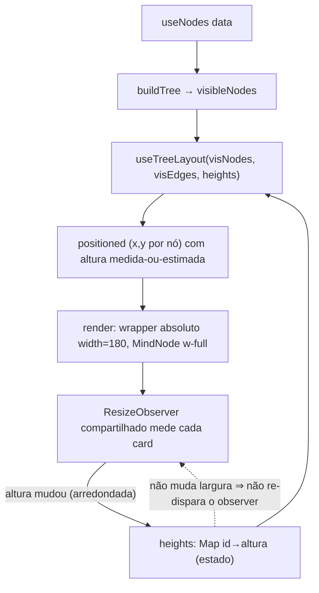

# M12 — Card responsivo (texto sempre visível + altura dinâmica) — Design

**Spec:** `.specs/features/m12-card-responsive/spec.md`
**Status:** Executado (gates verdes; pendente review AD-013, 2026-06-25)

---

## Architecture Overview

O coração da M12 é trocar a **altura-fórmula** (40/79 de `nodeSize.ts`) pela **altura medida no DOM**, realimentando o `computeTreeLayout` (que já trata altura por nó via `d3-flextree`). A largura segue **fixa** em `NODE_WIDTH=180` (resize é milestone futuro), e essa invariância é o que torna o pipeline convergente (ver _Invariante de convergência_).

Fluxo medir→layout:

**Primeiro paint:** `heights` vazio → `computeTreeLayout` usa a **estimativa** (`estimateNodeHeight`, ex-`nodeHeight`). O `ResizeObserver` dispara logo após o paint, preenche `heights` com as alturas reais, o layout recomputa e os cards assentam nas posições corretas. `fitView` é **adiado** até todos os nós visíveis terem altura medida, para enquadrar bounds reais (não estimados).

### Invariante de convergência (correção central)

A altura medida de um card é `H(node) = f(conteúdo, largura)`. Em M12 a **largura é constante** e o relayout só altera `left`/`top` (posição) do wrapper — **nunca a largura**. Logo:

> reposicionar um nó **não muda** sua altura medida ⇒ o `ResizeObserver` **não re-dispara** por causa do layout.

O observer só dispara em: (1) primeira medição; (2) mudança de **conteúdo** (editar título, ligar/desligar rodapé). Cada disparo causa **≤1** recálculo de layout, sem realimentação. Alturas são **arredondadas para inteiro** (`Math.round`) para matar jitter sub-pixel. Isso satisfaz M12-12/M12-14 (sem salto residual, sem loop medir↔layout).

---

## Code Reuse Analysis

### Componentes/utilitários a aproveitar

| Item | Local | Como usar |
| --- | --- | --- |
| `computeTreeLayout(tree, nodeSizeFn)` | `lib/useTreeLayout.ts:72` | **Sem mudança no núcleo** — já aceita `nodeSizeFn`. O hook passa um `sizeFn` que lê `heights` com fallback para a estimativa. |
| `d3-flextree` (`nodeSize` por nó) | `lib/useTreeLayout.ts:98-102` | Já trata altura variável por nó. Nada a fazer além de alimentar alturas reais. |
| Padrão `ResizeObserver` | `MapCanvas.tsx:197-209` (medição do container) | Mesmo padrão (observer em `ref`, callback ref). Replicar para um observer **compartilhado** dos cards. |
| `estimateNodeHeight` (ex-`nodeHeight`) | `lib/nodeSize.ts:10` | Vira **estimativa de primeiro paint** (fallback do `sizeFn`). Constantes `NODE_HEIGHT_BASE/WITH_FOOTER` permanecem (estimativa + uso de `slots.ts`). |
| `hasTaskProps` | `pages/map/components/task-meta.ts` | Continua decidindo presença do rodapé (afeta a estimativa e o que é medido). |
| `NodeTaskIndicators` + divisória (M11) | `MindNode.tsx:270-274` | Inalterados — entram na altura medida naturalmente. |

### Concerns relevantes (`.specs/codebase/CONCERNS.md`)

- **Teste vacuoso de não-sobreposição (L-005):** **já corrigido no M9** (`useTreeLayout.test.ts`, 3 filhos co-laterais de alturas distintas, asserção real). M12 não precisa refazê-lo; só garantir que segue verde com a estimativa/medição.
- **Fragile Areas `rfNodes`↔`useNodesState`:** obsoletas (removidas no M7) — não afetam M12.
- **Perf `simpleTreeLayout`:** arquivo removido no M7; o concern de 500 nós (RNF-01) segue no Gate v1 adiado. Um **observer compartilhado** (não N observers) mantém o custo de medição baixo.

---

## Components

### 1. `nodeSize.ts` — fórmula vira estimativa

- **Purpose:** Fornecer largura fixa e uma **estimativa** de altura para o primeiro paint (antes da medição).
- **Location:** `packages/web/src/lib/nodeSize.ts`
- **Mudanças:**
  - `NODE_WIDTH` permanece `180`.
  - Renomear `nodeHeight` → `estimateNodeHeight` (honestidade: é estimativa, não verdade). Doc atualizado.
  - `NODE_HEIGHT_BASE` (40) / `NODE_HEIGHT_WITH_FOOTER` (79) permanecem como base da estimativa e do `PLACEHOLDER_H` de `slots.ts` (território M13 — **não mexer**).
- **Reuses:** `hasTaskProps`.

### 2. `useMeasuredHeights` — hook de medição (novo)

- **Purpose:** Possuir o estado `heights` e um **único** `ResizeObserver` que mede os cards; expor um registrador de nó (ref callback estável por id).
- **Location:** `packages/web/src/pages/map/components/useMeasuredHeights.ts` (colocado com o canvas; não é compartilhado entre páginas — `frontend-structure.md`).
- **Interfaces:**
  - `useMeasuredHeights(): { heights: ReadonlyMap<string, number>; registerNode: (id: string) => (el: HTMLElement | null) => void }`
  - `registerNode(id)` retorna um **ref callback estável** (memoizado por id num `Map` interno): `el != null` → `observer.observe(el)` + guarda `el.dataset` já tem `data-node-id`; `el == null` → `observer.unobserve` + remove a entrada de `heights`.
  - Callback do observer: para cada entry, `id = target.dataset.nodeId`, `h = Math.round(borderBoxSize[0].blockSize ?? contentRect.height)`; atualiza `heights` **só se mudou** (preserva identidade do `Map` quando nada muda → evita recompute do `useMemo` do layout).
- **Dependencies:** `ResizeObserver` (DOM).
- **Reuses:** padrão de observer de `MapCanvas.tsx:197-209`.
- **Notas:** atualização imutável com detecção de mudança — retornar o **mesmo** `Map` quando nenhuma altura mudou (estabilidade de identidade é o que segura o `useMemo` de `useTreeLayout`).

### 3. `useTreeLayout` — aceitar alturas medidas

- **Purpose:** Calcular o layout usando alturas medidas quando disponíveis.
- **Location:** `packages/web/src/lib/useTreeLayout.ts`
- **Interfaces:**
  - `useTreeLayout(nodes, edges, heights?: ReadonlyMap<string, number>): LayoutResult`
  - Constrói `sizeFn = (n) => heights?.get(n.id) ?? estimateNodeHeight(n)` e chama `computeTreeLayout(tree, sizeFn)`.
  - `useMemo` deps: `[nodes, edges, heights]`.
- **Dependencies:** `computeTreeLayout` (inalterado), `estimateNodeHeight`.
- **Reuses:** o `nodeSizeFn` já é ponto de injeção existente — **zero mudança em `computeTreeLayout`**.

### 4. `MapCanvasInner` — fiação do estado de alturas

- **Purpose:** Conectar medição → layout → fit.
- **Location:** `packages/web/src/pages/map/components/MapCanvas.tsx`
- **Mudanças:**
  - `const { heights, registerNode } = useMeasuredHeights();`
  - `const { positioned, links, bounds } = useTreeLayout(visNodes, visEdges, heights);`
  - Calcular `allMeasured = positioned.length > 0 && positioned.every((p) => heights.has(p.id));`
  - Passar `registerNode` e `allMeasured` para `CanvasLayers`.
- **Reuses:** estrutura existente.

### 5. `CanvasLayers` — registrar nós + adiar fitView

- **Purpose:** Atribuir o ref de medição a cada wrapper e enquadrar só após medir.
- **Location:** `packages/web/src/pages/map/components/MapCanvas.tsx`
- **Mudanças:**
  - No `positioned.map(...)`, o wrapper ganha `ref={registerNode(p.id)}` (o `data-node-id` já existe — `MapCanvas.tsx:152`). O wrapper já tem `width: p.width`; a altura é `auto` (= altura do `MindNode`), que é o que medimos.
  - O efeito de `fitView` (`MapCanvas.tsx:80-92`) ganha a guarda `allMeasured`: só enquadra quando `width/height/bounds` existem **e** `allMeasured` é true (M12-08/M12-13).
- **Reuses:** wrapper e `fittedRef` existentes.

### 6. `MindNode` — texto que quebra

- **Purpose:** Exibir o título inteiro, quebrando em linhas.
- **Location:** `packages/web/src/pages/map/components/MindNode.tsx`
- **Mudanças (CSS):**
  - Span do título (`:198-199`): **remover `truncate`**; manter `block`; adicionar `break-words` (`overflow-wrap: break-word`) para palavra única longa (M12-01/M12-02). O container `flex-1 min-w-0` (`:185`) permanece (permite o flex child encolher e quebrar em vez de estourar).
  - Linha título/ícones (`:155` `flex items-center`): avaliar `items-start` para alinhar chevron/▲ à **primeira linha** do título multi-linha (refinamento estético — validar no smoke visual; não bloqueante).
  - **Input de edição inline permanece single-line** (fora de escopo — spec).
- **Reuses:** estrutura atual do card; divisória/rodapé M11 intactos.

---

## Data Models

Nenhum. **Sem schema, sem migration, sem coluna nova.** AD-002 intacta (a coluna `width` fica para o milestone de resize). Estado novo é só client-side (`heights: Map<string, number>` em memória).

---

## Error Handling Strategy

| Cenário | Tratamento | Impacto no usuário |
| --- | --- | --- |
| Nó ainda não medido (1º paint) | `sizeFn` cai na estimativa; `fitView` adiado até `allMeasured` | Assentamento sub-frame, sem flicker persistente (M12-13) |
| Conteúdo muda (edição/rodapé) | Observer dispara → `heights` atualiza → 1 relayout | Árvore reorganiza sem sobreposição (M12-09/10) |
| Nó removido/colapsado | Ref callback `null` → `unobserve` + remove de `heights` | Sem vazamento de observer/entrada stale |
| Altura sub-pixel oscilando | `Math.round` + atualização só-se-mudou | Sem loop medir↔layout (M12-14) |
| `borderBoxSize` indisponível (browser antigo) | Fallback `contentRect.height` | Medição segue funcionando |

---

## Tech Decisions (não-óbvias)

| Decisão | Escolha | Racional |
| --- | --- | --- |
| Mecanismo de medição | **Um `ResizeObserver` compartilhado** em `useMeasuredHeights` (não N observers) | Eficiência p/ mapas grandes (RNF-01); espelha o padrão do container (`MapCanvas.tsx:197`). |
| Fonte da altura no layout | `heights.get(id) ?? estimateNodeHeight(node)` via `nodeSizeFn` existente | `computeTreeLayout` não muda; injeção já existe (`:74`). |
| Destino da fórmula | Vira `estimateNodeHeight` (estimativa de 1º paint); constantes ficam | Evita bounds zerado/sobreposição grosseira antes de medir; `slots.ts`/M13 ainda usam `NODE_HEIGHT_BASE`. |
| Convergência | Largura fixa ⇒ posição não altera altura ⇒ observer não re-dispara; `Math.round` | Garante ponto fixo em ≤1 relayout (sem loop). |
| `fitView` | Adiado até `allMeasured` | Enquadrar bounds reais, não estimados. |
| Identidade do `Map` de alturas | Atualização imutável **só-se-mudou** (mesmo `Map` quando estável) | Segura o `useMemo` do layout (sem recompute espúrio). |
| Quebra de palavra | `break-words` no span do título | Palavra única > 180px quebra dentro do card (M12-02). |

---

## Test Strategy

- **Unit (`computeTreeLayout`)**: **inalterado em essência** — já injeta `nodeSizeFn`; os testes de geometria/altura variável (incl. o caso co-lateral corrigido no M9) seguem válidos com a estimativa. Adicionar, se útil, 1 teste do `sizeFn` de fallback (medido vence estimativa) se a lógica for extraída como helper puro.
- **Medição (`ResizeObserver`)**: não unit-testável de forma barata (DOM/timing). Coberta por **smoke visual** + e2e.
- **Smoke visual (Playwright screenshot) — obrigatório (gate L-005):** mapa com cards de 1, 2 e 4 linhas + palavra gigante → sem sobreposição, sem truncamento, `fitView` enquadra tudo. A tríade prova cálculo, não render — o smoke é quem pega isso (lição recorrente L-004/L-005).
- **e2e existentes**: seguem verdes (seletores `data-testid`, agnósticos à altura). Opcional: 1 asserção de que um título longo renderiza sem `text-overflow: ellipsis` (mínimo, AD-014).
- **Gates**: `pnpm typecheck && pnpm lint && pnpm test && pnpm test:e2e` (M12-17/18).

---

## Notas para Tasks (próxima fase)

Ordem sugerida (cada commit compilável; adicionar o novo ao lado do antigo antes de trocar):

1. `nodeSize.ts`: `nodeHeight` → `estimateNodeHeight` + doc (estimativa); ajustar o import em `useTreeLayout.ts`. Constantes intactas.
2. `useTreeLayout.ts`: aceitar `heights?` e montar o `sizeFn` com fallback. Atualizar testes que importam o símbolo renomeado, se houver.
3. `useMeasuredHeights.ts` (novo): observer compartilhado + `heights` + `registerNode` (ref callbacks estáveis, update só-se-mudou).
4. `MapCanvas.tsx`: fiar `useMeasuredHeights` em `MapCanvasInner`, passar `heights` ao layout, `registerNode`/`allMeasured` ao `CanvasLayers`; guarda `allMeasured` no `fitView`; `ref={registerNode(p.id)}` no wrapper.
5. `MindNode.tsx`: remover `truncate`, adicionar `break-words`; avaliar `items-start`.
6. Smoke visual + reconciliação de e2e; rodar a tríade + e2e.

**Pós-execução (não no diff de código):** atualizar `ROADMAP.md`/`STATE.md` — M12 reduz escopo para wrap+altura; registrar o milestone de resize com as decisões já fixadas (largura `width Int?` persistida, alça no hover). Confirmar numeração com o usuário.

---

> _Diagramas: o skill `mermaid-studio` não está instalado neste ambiente — usei mermaid inline. Para renderização/validação de diagramas vale instalar `mermaid-studio` (menção única)._
