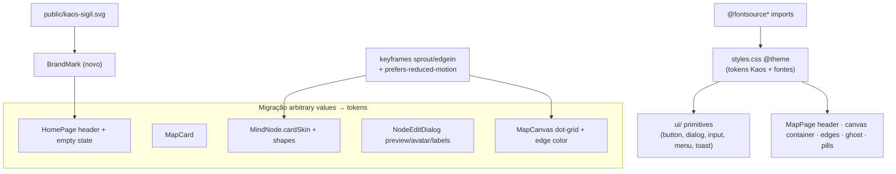

# M16 — Rebrand Kaos — Design

**Spec**: `.specs/features/m16-kaos-rebrand/spec.md`
**Status**: Draft

---

## Architecture Overview

Reskin puramente de apresentação. Nenhuma mudança de dados, contrato, rota, layout
(`useTreeLayout`/`slots.ts`) ou comportamento. A estratégia tem **quatro alavancas**:

1. **Tokens semânticos** (`styles.css` `@theme`) — redefinir a paleta e as fontes **uma vez**
   cascateia para todos os primitivos `ui/` (Button `bg-primary`→vermelho, Dialog
   `bg-popover`/overlay, Input, Menu, Toast) e para tudo que já usa tokens (header da MapPage,
   container do canvas `bg-muted`, edges `stroke-border`, barra-fantasma `bg-primary`, pill
   "Salvando…", estados de loading/erro). É o maior multiplicador do reskin.
2. **Abolir arbitrary values → tokens** ([[feedback-no-inline-hex]]) — nenhuma tela pode conter
   `bg-[#…]`/`text-[#…]`/`border-[#…]`. Toda cor de *design* vira token (semântico shadcn ou
   token Kaos próprio) ou utilitário padrão do Tailwind. Isso exige um **token set Kaos completo**
   (não só os 19 semânticos): superfícies, escala de foreground, marca e **tons frios do canvas**.
   Exceção legítima: cor de *dados do usuário* (`bgColor`/`textColor` do nó via `style={{}}`) —
   é dado, não estilo de tela.
3. **Fontes self-hosted** — trocar o `<link>` remoto do `index.html` por `@fontsource*`
   importados no bundle; apontar `--font-sans`/`--font-heading`/`--font-mono` para as fontes do guia.
4. **Asset + motion** — o sigilo `kaos-sigil.svg` entra em `public/` e é usado via CSS mask
   (tingível de vermelho, e como watermark); keyframes `sprout`/`edgeIn` adicionadas e guardadas
   por `prefers-reduced-motion`.

---

## Design Tokens (styles.css `@theme`)

Todos os hex do guia viram token. Duas famílias: **(A)** os 19 semânticos shadcn (nomes mantidos,
valores remapeados — cascateiam nos primitivos `ui/`), e **(B)** tokens Kaos próprios para o que os
semânticos não cobrem (superfícies extras, escala de foreground, marca, tons frios do canvas). No
Tailwind v4 cada `--color-x` em `@theme` gera `bg-x`/`text-x`/`border-x`/`ring-x`.

### (A) Semânticos shadcn — remapear valor

| Token                        | Atual             | Kaos                 | Uso                                    |
| ---------------------------- | ----------------- | -------------------- | -------------------------------------- |
| `--color-background`         | `#1a1a1a`         | `#0d0a09`            | body base                              |
| `--color-foreground`         | `#e8e6e3`         | `#ece7e3`            | texto principal                        |
| `--color-card`               | `#242424`         | `#15110f`            | card home / modal                      |
| `--color-card-foreground`    | `#e8e6e3`         | `#ece7e3`            | —                                      |
| `--color-popover`            | `#2e2e2e`         | `#1b1614`            | menus/popovers                         |
| `--color-popover-foreground` | `#e8e6e3`         | `#ece7e3`            | —                                      |
| `--color-primary`            | `#6b8aff` (azul)  | `#a0111b` (vermelho) | botão/acento primário                  |
| `--color-primary-foreground` | `#1a1a1a`         | `#ffffff`            | texto sobre vermelho                   |
| `--color-secondary`          | `#242424`         | `#1b1614`            | superfície secundária                  |
| `--color-secondary-foreground`| `#e8e6e3`        | `#ece7e3`            | —                                      |
| `--color-muted`              | `#242424`         | `#15110f`            | superfícies discretas                  |
| `--color-muted-foreground`   | `#a8a4a0`         | `#8a807b`            | labels/secundário                      |
| `--color-accent`             | `#2e2e2e`         | `#241c19`            | hover discreto                         |
| `--color-accent-foreground`  | `#e8e6e3`         | `#ece7e3`            | —                                      |
| `--color-destructive`        | `#e85a5a`         | `#c4151f`            | excluir                                |
| `--color-destructive-foreground`| `#fafafa`      | `#ffffff`            | —                                      |
| `--color-border`             | `#383838`         | `#241c19`            | bordas de superfície                   |
| `--color-input`              | `#2e2e2e`         | `#2c2420`            | borda de input                         |
| `--color-ring`               | `#6b8aff`         | `#a0111b`            | foco vermelho                          |

### (B) Tokens Kaos próprios

| Token                          | Valor                | Uso                                                    |
| ------------------------------ | -------------------- | ------------------------------------------------------ |
| `--color-background-glow`      | `#1b1310`            | 2º stop do gradiente radial da home                    |
| `--color-field`                | `#0e0b0a`            | fundo de inputs/textarea (mais escuro que o card)      |
| `--color-border-strong`        | `#2c2420`            | borda de modal/input mais visível                      |
| `--color-border-hover`         | `#3a2a26`            | borda de card no hover                                 |
| `--color-divider`              | `#1f1816`            | divisória interna do card (rodapé)                     |
| `--color-fg-subtle`            | `#6a615c`            | metadados mono (datas, "raiz · N ramos")               |
| `--color-fg-faint`             | `#5c534f`            | texto mais apagado (placeholder, "Ordenar")            |
| `--color-primary-hover`        | `#b8141f`            | hover do botão primário (não é opacidade)              |
| `--color-brand`                | `#c4151f`            | sigilo/glow (mais vivo que o primary)                  |
| `--color-critical`             | `#b0635a`            | dot do badge de críticos                               |
| `--color-critical-foreground`  | `#c79a8c`            | texto do badge de críticos (bg via `bg-primary/10`)    |
| `--color-canvas`               | `#101012`            | fundo do canvas                                        |
| `--color-canvas-dot`           | `rgba(255,255,255,.05)` | pontos do grid                                      |
| `--color-edge`                 | `#3a363d`            | aresta ramo→raiz                                       |
| `--color-edge-muted`           | `#33303a`            | aresta secundária                                      |
| `--color-edge-ghost`           | `#4a4550`            | aresta tracejada de reparent                           |
| `--color-node-root`            | `#19181c`            | fundo da raiz neutra                                    |
| `--color-node-root-border`     | `#38353f`            | borda da raiz                                          |
| `--color-node-toolbar`         | `#26242b`            | fundo da toolbar de hover do nó                        |
| `--color-node-toolbar-border`  | `#3a3742`            | borda da toolbar                                       |
| `--color-node-toolbar-hover`   | `#2a2830`            | hover dos botões da toolbar                            |

### Fontes

| Token            | Atual          | Kaos                   | Uso                     |
| ---------------- | -------------- | ---------------------- | ----------------------- |
| `--font-sans`    | Geist Variable | Space Grotesk Variable | corpo                   |
| `--font-heading` | = sans         | Chakra Petch           | títulos/logo            |
| `--font-mono`    | JetBrains Mono | IBM Plex Mono          | labels/datas/contadores |

**Radius:** o guia usa raios menores (cards 6–7px, nós 3–6px, botões 6px). Manter
`--radius: 0.625rem` e expressar os raios do guia via utilitários padrão (`rounded-md`/`rounded-lg`/
`rounded-sm`) ou tokens de radius, **sem** arbitrary values de radius onde um utilitário serve.

**Grid do canvas:** encapsular numa classe utilitária `.canvas-grid` em `styles.css`
(`background-color: var(--color-canvas)` + `background-image: radial-gradient(circle,
var(--color-canvas-dot) 1px, transparent 1.4px)` 24×24), para o `MapCanvas` usar `className="canvas-grid"`
sem cravar cor.

**cardSkin (MindNode):** os valores fixos de design (border/divider/toolbar da variante dark)
passam a referenciar tokens via `var(--color-…)`. As sobreposições da variante *light* (`rgba(0,0,0,.x)`)
permanecem como constantes calculadas — são overlays derivados da luminância do fundo do usuário,
não paleta de marca (mesma exceção de "dados do usuário").

---

## Fontes (self-hosted)

Pacotes verificados no npm (existem):

| Fonte         | Pacote                              | Versão | Pesos usados        |
| ------------- | ----------------------------------- | ------ | ------------------- |
| Chakra Petch  | `@fontsource/chakra-petch`          | 5.2.7  | 500, 600, 700 (estáticos) |
| Space Grotesk | `@fontsource-variable/space-grotesk`| 5.2.10 | variable            |
| IBM Plex Mono | `@fontsource/ibm-plex-mono`         | 5.2.7  | 400, 500 (estáticos) |

- Importar no topo do `styles.css` (antes das camadas) ou em `main.tsx`. Padrão do projeto hoje:
  `@import "@fontsource-variable/geist"` está no `styles.css` → seguir o mesmo lugar.
- Imports: `@fontsource-variable/space-grotesk`, `@fontsource/chakra-petch/{500,600,700}.css`,
  `@fontsource/ibm-plex-mono/{400,500}.css`.
- Remover `@import "@fontsource-variable/geist"` e a dependência Geist do `package.json`
  (não mais usada). Remover o `<link>` remoto Google Fonts do `index.html`.
- `font-display: swap` é padrão do @fontsource → fallback de sistema sem quebra (edge case da spec).

---

## Code Reuse Analysis

### Componentes/utilitários a reaproveitar (sem alteração de lógica)

| Componente / util        | Local                                             | Como usar                                        |
| ------------------------ | ------------------------------------------------- | ------------------------------------------------ |
| `contrast.ts`            | `pages/map/components/contrast.ts`                | Medidor de contraste do modal — **intacto**      |
| `color-palette.ts`       | `pages/map/components/color-palette.ts`           | Paleta BG/TEXT já alinhada ao guia — **intacto** |
| `task-meta.ts`           | `pages/map/components/task-meta.ts`               | Status label/cor + iniciais — **intacto**        |
| `NodeTaskIndicators`     | `pages/map/components/NodeTaskIndicators.tsx`     | Dot+label de status + avatar — ajustar só cor de avatar se cravada |
| `StatusSelector`         | `pages/map/components/StatusSelector.tsx`         | Botões de status — herda tokens; verificar hex   |
| `ColorSwatchGrid`        | `pages/map/components/ColorSwatchGrid.tsx`        | Ring de seleção já usa `ring-primary` → vermelho automático |
| `Button/Dialog/Input/Menu`| `components/ui/*`                                 | Herdam tokens redefinidos                        |
| `cardSkin()`             | `MindNode.tsx`                                     | Reajustar valores dark/light para o guia         |

### Integration points

| Sistema        | Método                                                              |
| -------------- | ------------------------------------------------------------------ |
| Backend/API    | **Nenhum.** `MapSummary` (nodeCount/criticalCount/createdAt) e `NodeDto` já bastam |
| Layout/canvas  | **Nenhum.** `useTreeLayout`/`slots.ts`/`useNodeDrag`/resize intactos |

---

## Extensão da migração (medida)

Decisão do usuário: **migrar todo o `packages/web/src`** (grep-guard 100% limpo). Arbitrary values
de cor em `className` hoje (medido): `HomePage.tsx` 31 · `MapCard.tsx` 9 · `MapCardMenu.tsx` 5 ·
`NodeEditDialog.tsx` 4 · `NodeTaskIndicators.tsx` 2 (**~51 total, 5 arquivos**). Somam-se os hex em
`style={{}}` do `cardSkin` (MindNode) e do preview (NodeEditDialog), migrados para `var(--color-…)`.
Demais arquivos herdam tokens (nada a migrar) — confirmar pelo grep final.

## Mapa de mudanças (arquivo-a-arquivo)

### Novos arquivos

| Arquivo                                   | Conteúdo                                                        | Req            |
| ----------------------------------------- | -------------------------------------------------------------- | -------------- |
| `packages/web/public/kaos-sigil.svg`      | Cópia do sigilo do guia (asset servido em `/kaos-sigil.svg`)   | M16-01, M16-07 |
| `packages/web/src/components/BrandMark.tsx`| Marca Kaos reutilizável (sigilo via CSS mask, tingível; props de tamanho/cor). Usada no header e no watermark do empty state | M16-01, M16-07 |

### Config / base

| Arquivo                         | Mudança                                                                                         | Req                     |
| ------------------------------- | ---------------------------------------------------------------------------------------------- | ----------------------- |
| `packages/web/index.html`       | Remover `<link>` Google Fonts remoto; `<title>` → "Kaos"                                        | M16-03                  |
| `packages/web/package.json`     | +`@fontsource/chakra-petch`, +`@fontsource-variable/space-grotesk`, +`@fontsource/ibm-plex-mono`; −`@fontsource-variable/geist` | M16-03 |
| `packages/web/src/styles.css`   | Tokens Kaos A+B (tabelas acima); imports de fonte; `--font-heading`/`--font-mono`; classe `.canvas-grid`; keyframes `sprout`/`edgeIn` + guard `prefers-reduced-motion` | M16-02, M16-03, M16-09, M16-13, M16-18 |

### Home ("Meus Mapas")

| Arquivo                                   | Mudança                                                                                             | Req            |
| ----------------------------------------- | -------------------------------------------------------------------------------------------------- | -------------- |
| `pages/home/HomePage.tsx`                 | Trocar todos os arbitrary values por tokens. Shell: gradiente `from var(--color-background-glow) to var(--color-background)`. Header: `<BrandMark>` + "KAOS" (`font-heading`, tracking largo) + tag "mapas mentais" (`font-mono`) com divisória. Título (`font-heading`), contador (`font-mono text-fg-subtle`). Botão "Novo mapa" `bg-primary hover:bg-primary-hover`. Busca/sort: `border-border`/`bg-card`, sort ativo em `primary`. Empty state → `<EmptyState>` com watermark do sigilo | M16-01, M16-04, M16-05, M16-07 |
| `pages/home/components/MapCard.tsx`       | Trocar arbitrary values por tokens: `bg-card border-border`, hover `hover:border-border-hover` + translateY + sombra. Métricas/rodapé `font-mono text-muted-foreground`/`text-fg-subtle`; divisória `border-divider`. Badge de críticos: `bg-primary/10 text-critical-foreground`, dot `bg-critical` | M16-06         |
| `pages/home/components/CreateMapModal.tsx`| Herda tokens (popover/overlay/input/botões). Ajustar cópia p/ tom Kaos ("Dê um nome ao despejo…") — opcional | M16-08         |

### Canvas ("Estudo de Nós")

| Arquivo                                   | Mudança                                                                                             | Req            |
| ----------------------------------------- | -------------------------------------------------------------------------------------------------- | -------------- |
| `pages/map/components/MapCanvas.tsx`      | Container: `className="canvas-grid"` (classe utilitária; sem cor cravada). Edges: `stroke-edge`/`stroke-edge-muted` (tokens frios). Barra-fantasma segue `bg-primary`. Trocar `bg-muted/30` remanescente | M16-09         |
| `pages/map/components/MindNode.tsx`       | `DEFAULT_BG` e valores fixos do `cardSkin` (dark) → tokens via `var(--color-node-*)`/`var(--color-*)`. Raiz neutra (`node-root`/`node-root-border`). Toolbar `node-toolbar`/`node-toolbar-border`/`node-toolbar-hover`. Cantos por papel via `rounded-md`/`rounded-sm` (`isRoot`/`hasChildren`, **sem** tocar layout). Animação `sprout` no mount | M16-10, M16-11, M16-12, M16-13 |
| `pages/map/components/NodeTaskIndicators.tsx` | Verificar/trocar qualquer hex cravado (avatar) por token/overlay derivado. Status vem de `task-meta` | M16-11 |

### Modal "Editar nó"

| Arquivo                                   | Mudança                                                                                             | Req            |
| ----------------------------------------- | -------------------------------------------------------------------------------------------------- | -------------- |
| `pages/map/components/NodeEditDialog.tsx` | Trocar arbitrary values por tokens. Labels de seção → `font-mono uppercase text-muted-foreground`. Preview: default → token neutro quente; avatar `#3a3a72`/`#cdcdf0` → tokens. Contraste: manter lógica (tons `emerald/amber/rose` já são utilitários padrão TW — ok). Swatch de texto: ring já `ring-primary`. Botões Cancelar/Salvar via primitivos. Estrutura de modal preservada | M16-14, M16-15, M16-16, M16-17 |
| `components/ui/dialog.tsx`                 | Overlay mais escuro (`bg-black/50`+blur) alinhado ao guia (`rgba(6,4,4,.66)`). Afeta todos os modais (consistência) | M16-14, M16-08 |

### Migração confirmada por grep (tem arbitrary values)

`pages/home/components/MapCardMenu.tsx` (5), `pages/map/components/NodeTaskIndicators.tsx` (2)
→ trocar por tokens (não é só "verificar").

### Varredura de verificação (herdam tokens; só ajustar se o grep acusar)

`components/ui/{menu,toast,toaster,input}.tsx`, `components/ConfirmDialog.tsx`,
`components/VersionBadge.tsx`, `pages/home/components/RenameMapInput.tsx`,
`pages/map/components/{StatusSelector,ColorSwatchGrid}.tsx`, `pages/map/MapPage.tsx`.
→ Ler cada um; se usa só tokens, nada a fazer; se acusar no grep, migrar.

---

## Components (novos)

### BrandMark

- **Purpose**: Renderiza a marca Kaos (sigilo tingível + opcionalmente o nome), reutilizável no
  header e como watermark do empty state.
- **Location**: `packages/web/src/components/BrandMark.tsx` (compartilhado entre 2+ superfícies → raiz de `components/`, conforme `.claude/rules/frontend-structure.md`).
- **Interfaces**:
  - `<BrandMark size?: number, color?: string, glow?: boolean, className?: string />` — só o sigilo (via `mask-image: url(/kaos-sigil.svg)` + `background-color`).
- **Dependencies**: asset `public/kaos-sigil.svg`.
- **Reuses**: nada; primitivo visual novo.

---

## Tech Decisions (não-óbvias)

| Decisão                              | Escolha                                                          | Racional                                                                 |
| ------------------------------------ | --------------------------------------------------------------- | ------------------------------------------------------------------------ |
| Como trocar a paleta                 | Token set Kaos completo (A+B) + **abolir arbitrary values** ([[feedback-no-inline-hex]]) | Tokens cascateiam nos primitivos e centralizam a paleta; nenhuma tela crava hex |
| Sigilo: `` vs CSS mask          | **CSS mask** (`mask-image`+`background-color`)                   | Permite tingir de vermelho, glow e watermark com opacidade — como o guia |
| Edges/toolbar/raiz no canvas         | Tokens Kaos próprios (`--color-edge*`, `--color-node-*`)         | São cinza-frio intencional; viram token (grupo B), não hex cravado — cascateiam e ficam auditáveis |
| Grid do canvas: estático vs pan-sync | **Estático** no container (como o mockup do guia)               | Evita mexer na matriz do `<Zoom>`; fiel ao guia; pan-sync fica p/ polish futuro |
| Cantos por papel do nó               | Só radius (raiz 6 / ramo 5 / folha 3) via `isRoot`/`hasChildren`| Cosmético, sem tocar layout; **não** invade M14 (skin por profundidade: tamanho/fonte/edge) |
| Motion                               | `sprout`/`edgeIn` só; reaproveitar animações base-ui do Dialog  | Menor superfície; `prefers-reduced-motion` respeitado                    |
| Overlay do Dialog                    | Escurecer no primitivo compartilhado                            | Consistência em todos os modais de uma vez                               |

---

## Riscos / o que NÃO tocar

- **Não tocar**: `useTreeLayout.ts`, `lib/slots.ts`, `useNodeDrag.ts`, resize (MapCanvas pointer
  handlers), `nodeSize.ts`, backend/contrato/schema, `contrast.ts`, `color-palette.ts`.
- **Regressão de testes**: e2e usa `data-testid` (`map-card`, `mind-node`, `node-title`,
  `resize-handle`, `ghost-slot`, `new-map-button`, `map-search`, `map-sort`, `assignee-input`,
  `critical-toggle`) — **preservar todos**. O reskin não deve remover/renomear testids nem textos
  usados por seletores de texto (verificar specs e2e antes de mudar labels visíveis).
- **`isDarkBg` no cardSkin**: mudar `DEFAULT_BG` para tom quente escuro mantém `dark=true` → sem
  regressão de contraste (edge case da spec).
- **Animação sprout em re-render**: aplicar no wrapper keyed por `p.id` (estável) e/ou no card
  memoizado → toca só no mount, não a cada pan/zoom/resize.

---

## Requirement → Files (traceability)

| Req    | Arquivos-chave                                                        |
| ------ | --------------------------------------------------------------------- |
| M16-01 | `public/kaos-sigil.svg`, `BrandMark.tsx`, `HomePage.tsx` (header)      |
| M16-02 | `styles.css` (tokens)                                                  |
| M16-03 | `styles.css`, `index.html`, `package.json`                            |
| M16-04 | `styles.css` (primary/ring), `HomePage.tsx` (botões)                   |
| M16-05 | `HomePage.tsx`                                                         |
| M16-06 | `MapCard.tsx`                                                          |
| M16-07 | `HomePage.tsx` (EmptyState), `BrandMark.tsx`                           |
| M16-08 | `CreateMapModal.tsx`, `ui/dialog.tsx`                                  |
| M16-09 | `MapCanvas.tsx`                                                        |
| M16-10 | `MindNode.tsx` (raiz)                                                  |
| M16-11 | `MindNode.tsx` (cardSkin/shapes), `NodeTaskIndicators.tsx`             |
| M16-12 | `MindNode.tsx` (toolbar)                                               |
| M16-13 | `styles.css` (keyframes), `MindNode.tsx`, `MapCanvas.tsx`             |
| M16-14 | `NodeEditDialog.tsx`, `ui/dialog.tsx`                                  |
| M16-15 | `NodeEditDialog.tsx` (preview)                                         |
| M16-16 | `NodeEditDialog.tsx` (contraste)                                       |
| M16-17 | `NodeEditDialog.tsx`, `ColorSwatchGrid.tsx`                            |
| M16-18 | `styles.css`, `MindNode.tsx`, `MapCanvas.tsx`                          |

---

## Verification Strategy

- **Gates** (sem regressão): `typecheck` + `lint` + unit (web/api) + e2e — todos verdes.
- **Zero arbitrary values de cor** ([[feedback-no-inline-hex]]): `grep -rE '(bg|text|border|ring|stroke|fill)-\[#' packages/web/src` deve ser **vazio**. Hex literal só é aceitável em módulos de *dados/lógica* (`color-palette.ts`, defaults de `contrast.ts`), não em `className` de tela.
- **Sem fonte remota**: DevTools Network sem requisição a `fonts.googleapis.com`/`gstatic`.
- **Smoke visual** (usuário): home (grid+empty+modal), canvas (grid+nós+toolbar+drag/resize),
  modal editar (preview+contraste). Comparar com screenshots do guia.
</content>
