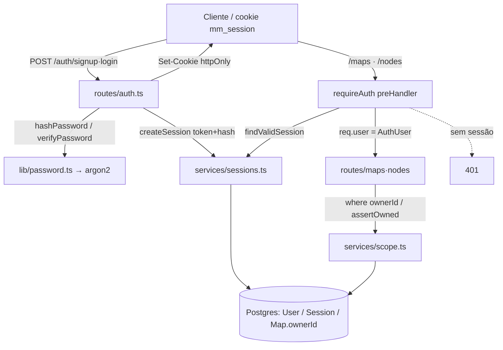

# M18 — Núcleo de auth backend — Design

**Spec**: `.specs/features/m18-auth-core/spec.md`
**Status**: Draft

> Só backend (`packages/api` + tipos em `packages/shared`). Introduz identidade + tenancy.
> Decisões de arquitetura macro já em **AD-025**; este doc fixa o **como** concreto.

---

## Architecture Overview

Sessão **server-side opaca**: no login/signup o servidor gera um token aleatório de alta entropia,
grava só o **hash** dele numa linha de `Session` e devolve o token cru num **cookie httpOnly**. A cada
requisição, um preHandler (`requireAuth`) lê o cookie, re-hasheia, busca a `Session`, valida expiração e
anexa `req.user`. As rotas de `maps`/`nodes` ganham esse preHandler + filtram tudo por `ownerId`.



**Fluxo de encapsulamento (Fastify 5):**

- `@fastify/cookie` registrado no topo do `app` (usa `fastify-plugin` internamente → decorators `req.cookies`/`reply.setCookie` disponíveis em toda a árvore).
- `app.decorateRequest('user', null)` no topo (disponível app-wide).
- `routes/auth` registrado em `/auth` — **sem** guarda global (signup/login/logout públicos; `me` e `logout` tratam sessão por conta própria).
- `routes/maps` e `routes/nodes` chamam `app.addHook('preHandler', requireAuth)` no topo do próprio plugin → a guarda vale só dentro do escopo encapsulado de cada um. `/health` fica intocado.

---

## Code Reuse Analysis

### Componentes existentes a aproveitar

| Componente                         | Local                                  | Como usar                                                                 |
| ---------------------------------- | -------------------------------------- | ------------------------------------------------------------------------- |
| `ApiError`/`NotFoundError`/`ConflictError` | `packages/api/src/errors.ts`     | Estender com `UnauthorizedError(401)`; erros de escopo reusam `NotFoundError` (404). |
| Error handler central              | `packages/api/src/app.ts` (`setErrorHandler`) | Já mapeia `ApiError`→status, `P2002`→409, `P2025`→404, Zod→400. Só cair nele. |
| Padrão de plugin Zod               | `routes/maps.ts`, `routes/nodes.ts`    | `FastifyPluginAsyncZod` + `schema.body` — `routes/auth.ts` segue o mesmo molde. |
| Padrão de mapper                   | `mappers/maps.ts`, `mappers/nodes.ts`  | `mappers/users.ts` (`toAuthUser`) no mesmo estilo (nunca expõe `passwordHash`). |
| Tipos compartilhados               | `packages/shared/src/{map,node}.ts` + `index.ts` | `packages/shared/src/auth.ts` com `AuthUser`/`SignupBody`/`LoginBody`, reexport no `index.ts`. |
| `prisma` singleton                 | `packages/api/src/prisma.ts`           | Reusar; transações via `prisma.$transaction`.                             |
| `env` loader                       | `packages/api/src/env.ts`              | Adicionar `COOKIE_SECURE` (default `false`).                              |

### Pontos de integração

| Sistema                    | Integração                                                                                     |
| -------------------------- | ---------------------------------------------------------------------------------------------- |
| Rotas `maps`/`nodes` atuais | Ganham `requireAuth` + filtro por `ownerId` via `services/scope.ts`. Lógica de negócio (sortOrder global, anti-ciclo AD-008, side/AD-018, width/AD-023) **intacta**. |
| `GET /maps` agregações     | `findMany` e `groupBy` (críticos) ganham `where: { ownerId }` / `where: { map: { ownerId } }`. |
| Testes de integração       | `maps.test.ts`/`nodes.test.ts` passam a autenticar (helper de teste `createUserWithSession`).   |

### Concerns (CONCERNS.md)

Não há `CONCERNS.md` entry pré-existente que bloqueie o M18. **Novo concern a registrar na execução:** cookie `Secure` desligado em prod HTTP (ver "Risco" na spec). O design **centraliza o escopo** (`services/scope.ts` + preHandler único) exatamente para mitigar o risco de vazamento por `where` espalhado.

---

## Data Models

```prisma
model User {
  id           String    @id @default(cuid())
  email        String    @unique                       // sempre gravado normalizado (trim + lowercase)
  passwordHash String    @map("password_hash")
  name         String
  createdAt    DateTime  @default(now()) @map("created_at")
  updatedAt    DateTime  @updatedAt @map("updated_at")
  sessions     Session[]
  maps         Map[]
  @@map("User")
}

model Session {
  id        String   @id @default(cuid())
  tokenHash String   @unique @map("token_hash")        // sha256(token cru); o cookie tem o token, o banco não
  userId    String   @map("user_id")
  expiresAt DateTime @map("expires_at")
  createdAt DateTime @default(now()) @map("created_at")
  user      User     @relation(fields: [userId], references: [id], onDelete: Cascade)
  @@index([userId])
  @@map("Session")
}

// Map ganha:
model Map {
  // ...campos atuais...
  ownerId String? @map("owner_id")                      // nullable por ora (ver M18-16); FK → User
  owner   User?   @relation(fields: [ownerId], references: [id], onDelete: Cascade)
  @@index([ownerId])
}
```

**Decisões do modelo:**
- **`email @unique` cobre a unicidade case-insensitive** porque sempre gravamos/consultamos já normalizado (`trim`+`lowercase`) — não precisa de índice funcional `lower(email)`.
- **Token nunca em claro no banco:** `tokenHash = sha256(token)`. Um vazamento do banco não dá tokens usáveis. SHA-256 (não argon2) basta aqui: o token já tem 256 bits de entropia (não é adivinhável por força bruta como uma senha).
- **`Map.owner onDelete: Cascade`** — apagar um usuário (futuro) leva seus mapas junto; coerente com `Node` já ser cascade do `Map`.
- **`ownerId` nullable** — necessário para a migração aditiva sem downtime e para a janela pré-primeiro-signup (M18-16). Enforçar NOT NULL fica deferred.

### Tipos compartilhados (`packages/shared/src/auth.ts`)

```typescript
export interface AuthUser { id: string; email: string; name: string }      // resposta pública; nunca inclui hash
export interface SignupBody { email: string; password: string; name: string; remember?: boolean }
export interface LoginBody  { email: string; password: string; remember?: boolean }
export type AuthResponse = AuthUser;
```

---

## Components

### `lib/password.ts`
- **Purpose**: Isolar o argon2 atrás de duas funções testáveis.
- **Interfaces**:
  - `hashPassword(plain: string): Promise<string>` — `argon2.hash(plain)` (argon2id default).
  - `verifyPassword(hash: string, plain: string): Promise<boolean>` — `argon2.verify(hash, plain)`, captura exceção → `false`.
- **Dependencies**: `argon2` (nova dep). **Reuses**: —.

### `services/sessions.ts`
- **Purpose**: Ciclo de vida da sessão opaca (gerar, validar, revogar) + política de expiração.
- **Interfaces**:
  - `createSession(userId: string, remember: boolean): Promise<{ token: string; maxAgeSeconds: number }>` — `token = randomBytes(32).base64url`; grava `{ tokenHash: sha256(token), userId, expiresAt: now + ttl }`; `ttl = remember ? 30d : 7d`.
  - `findValidSession(token: string): Promise<AuthUser | null>` — hash + `findUnique({ tokenHash })` incluindo `user`; se ausente → `null`; se `expiresAt <= now` → apaga a linha e retorna `null`; senão `toAuthUser(user)`.
  - `deleteSession(token: string): Promise<void>` — hash + `deleteMany({ tokenHash })` (idempotente).
- **Constantes**: `SESSION_TTL_DAYS = 7`, `SESSION_TTL_REMEMBER_DAYS = 30`, `SESSION_COOKIE_NAME = 'mm_session'`.
- **Dependencies**: `crypto` (node), `prisma`, `toAuthUser`. **Reuses**: `mappers/users.ts`.
- **Nota de teste**: `sha256` e a política de expiração são puras/determinísticas → unit. A aleatoriedade do token é exercida via integração.

### `plugins/auth-guard.ts` (`requireAuth` + helpers de cookie)
- **Purpose**: PreHandler que exige sessão e helpers de Set-Cookie.
- **Interfaces**:
  - `requireAuth(req, reply): Promise<void>` — lê `req.cookies[COOKIE_NAME]`; `findValidSession`; se `null` → `clearSessionCookie(reply)` + `throw new UnauthorizedError()`; senão `req.user = authUser`.
  - `setSessionCookie(reply, token, maxAgeSeconds): void` — `reply.setCookie(name, token, { httpOnly, sameSite: 'lax', path: '/', secure: env.COOKIE_SECURE, maxAge })`.
  - `clearSessionCookie(reply): void` — `reply.clearCookie(name, { path: '/' })`.
- **Dependencies**: `services/sessions.ts`, `env`, `errors`. **Reuses**: `@fastify/cookie` decorators.
- **Nota**: `requireAuth` é função pura de handler (não plugin encapsulado) → `maps.ts`/`nodes.ts`/`me` importam e registram como hook.

### `services/scope.ts`
- **Purpose**: Ponto único de verificação de posse (evita `where` espalhado — mitigação do concern de vazamento).
- **Interfaces** (aceitam `tx` ou `prisma`):
  - `findOwnedMap(db, mapId, userId): Promise<Map>` — `findFirst({ where: { id: mapId, ownerId: userId } })`; `null` → `NotFoundError('Map not found')`.
  - `findOwnedNode(db, nodeId, userId): Promise<Node>` — `findFirst({ where: { id: nodeId, map: { ownerId: userId } } })`; `null` → `NotFoundError('Node not found')`.
- **Dependencies**: `prisma` types, `errors`. **Reuses**: `NotFoundError`.
- **Padrão de uso**: leituras de lista filtram `where: { ownerId }` direto; leituras/mutações por id passam por essas funções; `POST /maps` seta `ownerId: userId`; `POST /nodes` valida `parentId` via `findOwnedNode(parentId)`.

### `mappers/users.ts`
- **Purpose**: `toAuthUser(user): AuthUser` — projeta só `{ id, email, name }`. **Reuses**: padrão de `mappers/maps.ts`.

### `routes/auth.ts` (`/auth`)
- **Purpose**: Endpoints de auth.
- **Rotas**:
  - `POST /signup` — Zod `{ email, password(min8), name(min1), remember? }`; normaliza email; `hashPassword`; `$transaction`: cria `User` → se `count()===1` (primeiro usuário) `map.updateMany({ where:{ ownerId:null }, data:{ ownerId:user.id } })` (o `WHERE null` é a salvaguarda de concorrência) → `createSession`; `setSessionCookie`; `201` `toAuthUser`. `P2002` (email dup) cai no handler central → 409.
  - `POST /login` — Zod `{ email, password, remember? }`; normaliza; `findUnique({ email })` + `verifyPassword`; falha em qualquer etapa → `UnauthorizedError('Invalid credentials')` **genérico**; sucesso → `createSession` + cookie + `200`.
  - `POST /logout` — lê cookie; `deleteSession` (se houver); `clearSessionCookie`; `204` sempre (idempotente; **sem** `requireAuth`).
  - `GET /me` — `preHandler: requireAuth`; `200` `req.user`.
- **Dependencies**: `lib/password`, `services/sessions`, `plugins/auth-guard`, `mappers/users`, `prisma`, `errors`.

### Alterações em rotas existentes
- **`routes/maps.ts`**: `app.addHook('preHandler', requireAuth)`; `GET /` → `findMany({ where:{ ownerId } })` + `groupBy` críticos com `where:{ isCritical:true, map:{ ownerId } }`; `POST /` seta `ownerId: req.user.id`; `GET/PATCH/DELETE /:id` e `GET /:id/nodes` trocam o `findUnique` por `findOwnedMap(db, id, userId)`.
- **`routes/nodes.ts`**: `app.addHook('preHandler', requireAuth)`; `POST /` valida `parentId` via `findOwnedNode`; `PATCH/DELETE /:id` e `PATCH /:id/move` resolvem o nó por `findOwnedNode` (o `move` valida também o `newParentId` via `findOwnedNode`). Renumeração/anti-ciclo/side/width **inalterados**.

### `app.ts` (composição)
- `app.register(fastifyCookie)` antes das rotas; `app.decorateRequest('user', null)`; `app.register(authPlugin, { prefix: '/auth' })`. `maps`/`nodes` seguem registrados como hoje (a guarda mora dentro deles).
- Augment de tipo: `declare module 'fastify' { interface FastifyRequest { user: AuthUser | null } }` (num `types/fastify.d.ts` ou no topo do guard).

### `env.ts`
- `COOKIE_SECURE: (process.env['COOKIE_SECURE'] ?? 'false') === 'true'`. Default `false` (prod atual é HTTP — AD-022). Ligar quando houver TLS.

---

## Error Handling Strategy

| Cenário                                   | Tratamento                                              | Resposta          |
| ----------------------------------------- | ------------------------------------------------------ | ----------------- |
| Sem sessão / cookie inválido / expirado   | `requireAuth` limpa cookie + `UnauthorizedError`        | `401` genérico    |
| Login com email inexistente **ou** senha errada | `UnauthorizedError('Invalid credentials')` idêntico | `401` genérico    |
| Signup com email já existente             | `@unique` → `P2002` no handler central                  | `409`             |
| Senha < 8 / email malformado / nome vazio | Zod `schema.body`                                       | `400`             |
| Mapa/nó de outro dono ou inexistente      | `findOwnedMap`/`findOwnedNode` → `NotFoundError`        | `404` (não vaza)  |
| `move`/`create` com parent de outro dono  | `findOwnedNode(parentId)` → `NotFoundError`             | `404`             |

---

## Tech Decisions (só as não-óbvias)

| Decisão                         | Escolha                                             | Racional                                                                                   |
| ------------------------------- | --------------------------------------------------- | ------------------------------------------------------------------------------------------ |
| Sessão stateful vs JWT          | **Session server-side (tabela)**                    | AD-025 exige revogação real no logout; JWT stateless não revoga.                           |
| Token no banco                  | **sha256(token)**, cookie leva o cru                | Vazamento de DB não dá sessões usáveis; SHA-256 basta (token já tem 256 bits).             |
| Cookie assinado (`@fastify/cookie` secret) | **Não assinar**                          | Token opaco de alta entropia + hash no banco já garante integridade/segredo; menos config. |
| Escopo por dono                 | **`services/scope.ts` + relation filter** (`map:{ ownerId }`) | Um só ponto de verificação; `findFirst` pela relação resolve nó→mapa→dono numa query. |
| Acesso cruzado                  | **404** (não 403)                                   | Não vaza existência de recurso alheio (M18-13/14).                                          |
| Herança de órfãos               | **1º signup, `WHERE ownerId IS NULL`**              | Decisão do usuário; o `WHERE null` torna idempotente e seguro em corrida (2º claim afeta 0 linhas). |
| `ownerId` NOT NULL              | **Adiado (nullable)**                               | Migração aditiva sem downtime; nulos só na janela pré-1º-signup, sem acesso autenticado.    |
| Params do argon2                | **defaults do node-argon2 (argon2id)**              | Seguros para uso pessoal; tuning OWASP (memoryCost≈19MiB) é ajuste futuro se necessário.    |

---

## Migration Plan

1. Editar `schema.prisma` (User, Session, `Map.ownerId?` + relações/índices).
2. `prisma migrate dev --name add_auth_users_sessions_owner` → migração **aditiva** (novas tabelas + coluna nullable + FKs). Nenhum dado destruído; mapas atuais ficam `ownerId = NULL` (órfãos).
3. **Herança** roda em runtime no 1º signup (M18-17), não em SQL de migração — evita ter que existir um usuário no momento da migração.
4. Dev: aplicar em `dev_mindmap` (túnel SSH AD-006). **Prod**: a migração roda no deploy; **cadastre-se logo depois** para reivindicar os mapas (janela órfã descrita na spec).

---

## Testing Strategy (para orientar Tasks)

- **Unit (api, vitest):** `lib/password` (hash≠plain, verify ok/ko), `services/sessions` (sha256 estável, expiração → null + apaga), `services/scope` (owned vs não-owned → NotFound).
- **Integração (api, `app.inject`):**
  - auth: signup 201+cookie, email dup 409, senha curta 400, login ok/errado (401 genérico idêntico), logout 204 + cookie revogado → me 401, me sem/comm sessão.
  - herança: banco com mapa órfão → 1º signup vê o mapa; 2º signup vê vazio.
  - **isolamento (não-vacuoso):** user A cria mapa+nó; user B → `GET /maps` sem o de A, `GET /maps/:idA` 404, `PATCH /nodes/:noA` 404, `DELETE /maps/:idA` 404.
  - guarda: qualquer rota maps/nodes sem cookie → 401.
- **Reconciliação (M18-21):** helper `createUserWithSession()` (cria user via prisma + session, devolve o cookie) usado por `maps.test.ts`/`nodes.test.ts`; cada `inject` passa `cookies: { mm_session: token }`.
- **e2e/smoke visual:** **fora do M18** (não há UI) — entram no M19 e no review AD-013.

**Dependência de DB:** os testes de integração exigem o Postgres de teste (`.env.test`/`dev_mindmap`, AD-006/L-007). Unit puro roda sem DB.

---

## Novas dependências

| Pacote            | Onde            | Versão alvo        | Uso                                   |
| ----------------- | --------------- | ------------------ | ------------------------------------- |
| `argon2`          | `packages/api`  | ^0.41 (atual)      | hash/verify de senha (argon2id).      |
| `@fastify/cookie` | `packages/api`  | ^11 (Fastify 5)    | parse/serialize de cookie httpOnly.   |

*(Versões a confirmar no `pnpm add`; ambas compatíveis com Fastify 5 / Node 22 — ver verificação na conversa.)*
</content>
