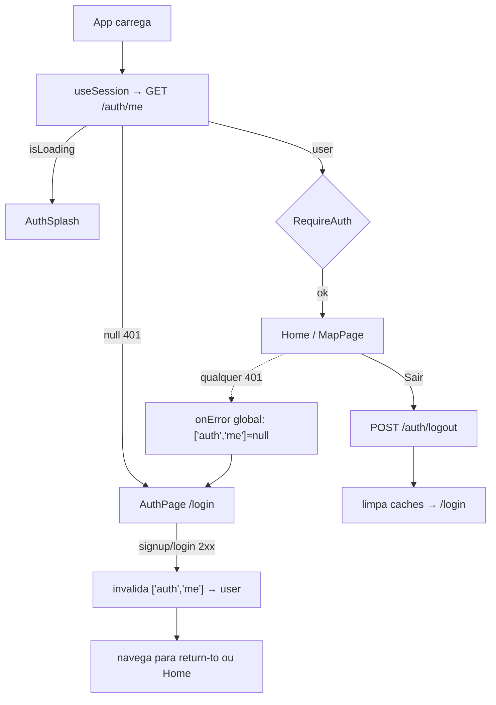

# M19 — Tela de auth + guarda no front — Design

> Consome o contrato do M18. Só `packages/web`. Segue `context.md` (decisões de HOW) e as
> convenções do projeto (api fns + `use*` hooks TanStack, componentes colocados, alias `@/`,
> imports `.js`, tokens do design system M16, sem hex inline).

## Visão geral do fluxo



**Fonte única de verdade da sessão**: a query `['auth', 'me']`. Guarda, redirects e header da Home
leem dela; login/logout apenas a invalidam/atualizam. Sem contexto/reducer próprio — o cache do
TanStack Query já deduplica e compartilha. (Proposta de registro: **AD-026** em STATE.md.)

## Contrato consumido (M18, inalterado)

| Chamada | Método | Sucesso | Erros tratados no front |
| --- | --- | --- | --- |
| `signup` | `POST /api/auth/signup` `{email,password,name,remember?}` | `201` `AuthUser` | `409` → banner "Este e-mail já está em uso"; `400` → não deve ocorrer (validado no cliente antes) |
| `login` | `POST /api/auth/login` `{email,password,remember?}` | `200` `AuthUser` | `401` → banner "E-mail ou senha incorretos" (única) |
| `logout` | `POST /api/auth/logout` | `204` | — |
| `me` | `GET /api/auth/me` | `200` `AuthUser` | `401` → **não é erro**: sessão ausente (usuário `null`) |

Tipos já existem em `@mindmap/shared` (`AuthUser`, `SignupBody`, `LoginBody`, `AuthResponse`) — o
front só consome; **nenhum tipo novo no shared** e nenhum toque no backend.

## Componentes / módulos

### Camada de API — `src/api/auth.ts` (novo)
- Request fns: `signupRequest(body)`, `loginRequest(body)`, `logoutRequest()`, `fetchMe()`.
  - `fetchMe`: em `ApiError` `401` **retorna `null`** (sessão ausente), rethrow nos demais.
- Hooks:
  - `useSession()` → `useQuery({ queryKey:['auth','me'], queryFn:fetchMe, retry:false, staleTime:Infinity })`; expõe `user`, `isLoading`, `isAuthenticated`.
  - `useSignup()` / `useLogin()` → `useMutation`; `onSuccess` faz `queryClient.setQueryData(['auth','me'], user)`.
  - `useLogout()` → `useMutation`; `onSuccess` faz `setQueryData(['auth','me'], null)` + `queryClient.clear()` (descarta caches de maps/nodes do usuário anterior).
- Segue o shape de `src/api/maps.ts` (`QueryOptions`/`MutationOptions` de `./types.js`).

### Credenciais — `src/api/_request.ts` (modificar)
- Garantir envio do cookie httpOnly `mm_session`: `fetch(url, { credentials: 'same-origin', ...init })`.
  Requests são same-origin (URLs relativas `/api/...`, nginx/Vite proxy); `same-origin` basta e é
  mais estrito que `include`. Mudança de 1 linha, sem alterar assinatura.

### Guarda global de `401` — `src/main.tsx` (modificar)
- No `QueryClient`, adicionar `QueryCache` com `onError`: se `error instanceof ApiError && status===401` e a query **não** é `['auth','me']`, então `queryClient.setQueryData(['auth','me'], null)`. Assim uma sessão expirada em qualquer request de maps/nodes derruba a guarda (M19-14) sem espalhar tratamento por hook.

### Guarda de rota — `src/auth/` (novo)
- `RequireAuth.tsx`: usa `useSession()`. `isLoading` → `<AuthSplash/>`; `!user` → `<Navigate to="/login" state={{ from: location }} replace/>`; senão `<Outlet/>`. Rota-layout.
- `RedirectIfAuthed.tsx`: para `/login`. `isLoading` → `<AuthSplash/>`; `user` → `<Navigate to={from ?? '/'} replace/>`; senão renderiza a tela.
- `AuthSplash.tsx`: estado de carregamento em tela cheia (spinner/sigilo KAOS discreto), tokens M16.

### App / rotas — `src/App.tsx` (modificar)
```
<Routes>
  <Route path="/login" element={<RedirectIfAuthed><AuthPage/></RedirectIfAuthed>} />
  <Route element={<RequireAuth/>}>
    <Route path="/" element={<HomePage/>} />
    <Route path="/maps/:id" element={<MapPage/>} />
  </Route>
</Routes>
```
`VersionBadge` permanece fora das rotas.

### Tela de auth — `src/pages/auth/` (novo)
- `AuthPage.tsx`: estado `mode: 'entrar' | 'cadastro'`, `name/email/password`, `showPass`, `remember`, `fieldErrors`, banner. Fio: valida no cliente (M19-06) → dispara `useLogin`/`useSignup` → sucesso navega para `location.state.from ?? '/'`; erro mapeia status→banner. Botão usa `isPending` da mutation (M19-08). Espelha o layout do design (card, sigilo, toggle de modo no footer).
- `components/AuthField.tsx`: label + input + erro inline (reusa `components/ui/input.js`).
- `components/PasswordField.tsx`: input com toggle de olho (label mostrar/ocultar).
- `components/ErrorBanner.tsx`: banner no topo do card (só quando há erro de servidor).
- `validation.ts`: `validateAuth(mode, values) → fieldErrors`; `messageForError(error) → string` (mapa status→pt-BR: 401/409/fallback). **Puro e testável** (M19-19).
- **Removidos do design nesta etapa** (M19-04): Google + "ou", "Esqueci a senha"/recuperar, footer legal.

### Logout na Home — `src/pages/home/HomePage.tsx` (modificar)
- Botão "Sair" **temporário** no header (perto do título), `useLogout()`; `onSuccess` → `navigate('/login')`. Marcado no código como provisório até o menu de conta do M20.

## Mapa de reúso

| Já existe | Uso no M19 |
| --- | --- |
| `src/api/_request.ts` (`request`, `ApiError`) | base das chamadas + leitura de `{ error }`; `ApiError.status` alimenta banner e guarda 401 |
| `src/api/types.ts` (`QueryOptions`/`MutationOptions`) | assinatura dos hooks de auth |
| `@mindmap/shared` auth types | payloads/resposta — nada novo |
| `components/ui/{input,button}.js`, `cn` | campos e botões da tela |
| Tokens design system M16 (`styles.css`) | cores/tipografia — sem hex inline |
| React Router (`Navigate`, `Outlet`, `useLocation`, `useNavigate`) | guarda + return-to |
| TanStack Query cache | fonte única da sessão; invalidação no login/logout |

## Estratégia de testes

- **Unit (Vitest)**: `validation.test.ts` (regras por campo + `messageForError`); `fetchMe` mapeando 401→null; comportamento do `RequireAuth`/`RedirectIfAuthed` (render com sessão mockada → Outlet vs. redirect com `from`).
- **e2e (Playwright)**: fluxo jogável — criar conta → cai na Home autenticada; Sair → `/login`; entrar de volta; **return-to** (abrir `/maps/:id` deslogado → login → volta ao mapa após entrar); erro de credenciais mostra banner. Requer DB de teste (usuário criado no próprio fluxo de signup).
- **Não-vacuosidade**: os testes de guarda devem provar *ambos* os ramos (redirect e liberação); e2e prova que maps/nodes autenticam (não 401).
- Gates (M19-20): typecheck `-r`, lint (grep-guard hex), unit web+api, e2e. Backend intocado → suíte api deve seguir idêntica.

## Decisões de arquitetura (para STATE)

- **AD-026 (proposta)**: no front, a sessão é modelada como a query `['auth','me']` (fonte única);
  login/logout mutam o cache; `401` global zera a sessão. Sem context/store dedicado — evita
  duplicar estado que o TanStack Query já mantém. Guarda via rota-layout `RequireAuth`
  (`<Outlet/>`) + `RedirectIfAuthed` no `/login`, com return-to por `location.state.from`.

## Riscos / atenção

- **Cookie em same-origin**: se dev/prod não forem estritamente same-origin em algum ambiente, o
  cookie pode não ir — validar no e2e/smoke (maps autenticam, não 401). Fallback documentado:
  `credentials:'include'` (exige CORS credenciado no backend — evitar se same-origin resolve).
- **`queryClient.clear()` no logout**: garante que o próximo usuário não veja mapas cacheados do
  anterior; conferir que não quebra telas montadas no instante do logout (navegar antes de limpar).
- **StrictMode** dobra efeitos em dev — o bootstrap `/me` deve ser idempotente (query já é).
