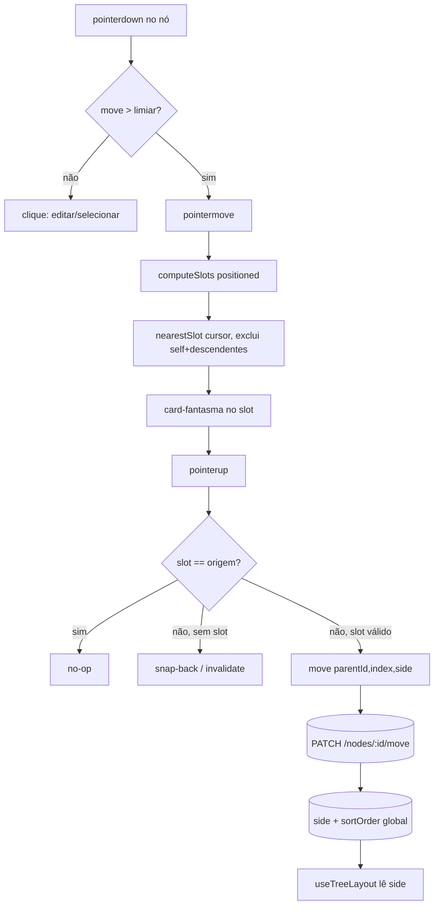

# M9 — Drag-to-place unificado — Design

**Spec**: `.specs/features/m9-drag-to-place/spec.md`
**Status**: Approved (2026-06-25)

---

## Decisão-chave (confirmada com o usuário, 2026-06-25)

**`sortOrder` dos filhos da raiz é GLOBAL; `side` é um rótulo independente.** Todos os
filhos diretos da raiz mantêm uma única sequência `sortOrder` 0..n (como qualquer outro
grupo de irmãos); o lado (`LEFT`/`RIGHT`) é uma coluna à parte, consultada só para
`parentId === root`. O layout filtra por lado e ordena por `sortOrder` dentro de cada lado.

Consequência (a razão da escolha): o endpoint `move` (AD-008) mantém a renumeração global
intacta — a única extensão é **gravar `side`** quando o destino é/deixa de ser filho da
raiz. A complexidade de "slot visual de um lado → índice global" mora no **frontend**, em
função pura unit-testável. Isso protege o núcleo revisado do backend e concentra o novo
risco em código novo e testável.

---

## Architecture Overview

Gesto unificado: durante o arraste, o frontend enumera os **slots** `(parentId, index, side?)`
a partir do `positioned` atual, escolhe o mais próximo do cursor, mostra um **card-fantasma**
nele e, ao soltar, dispara **uma** mutação `move({ parentId, index, side? })`. O backend grava
`side` e renumera globalmente como hoje. O `side` persistido alimenta o layout no próximo render.



---

## Code Reuse Analysis

### Existing Components to Leverage

| Componente | Localização | Como usar |
| --- | --- | --- |
| `move` endpoint (anti-ciclo, renumeração transacional) | `packages/api/src/routes/nodes.ts:91` | Estender: aceitar `side` opcional; gravar `side` quando pai = raiz, limpar quando sai. Renumeração global **inalterada**. |
| `splitChildren` (heurística de peso) | `packages/web/src/lib/useTreeLayout.ts:57` | **Portar para o backend** (`create`) como default de lado. Sai do layout. |
| `computeTreeLayout` / `layoutSide` | `packages/web/src/lib/useTreeLayout.ts:96` | Manter a geometria bilateral; trocar a fonte do split (peso → `side` persistido). |
| `findDropTarget` (hit-test puro) | `packages/web/src/pages/map/components/useNodeDrag.ts:11` | Generalizar para `nearestSlot` (devolve slot, não só id; exclui self **e descendentes**). |
| `useNodeDrag` (limiar, pointer capture, ghostOffset) | `packages/web/src/pages/map/components/useNodeDrag.ts` | Estender: rastrear slot-alvo durante o move; `onReparent` → `onPlace(slot)`. |
| `useMoveNode` (optimistic) | `packages/web/src/api/nodes.ts:191` | Ajustar optimistic para `index` real + `side` (hoje só faz append). |
| `toNodeDto` / `NodeDto` | `mappers/nodes.ts` / `shared/src/node.ts` | Adicionar `side`. |

### Integration Points

| Sistema | Integração |
| --- | --- |
| Prisma schema | Novo enum `Side` + coluna `side Side?` em `Node` + migration + backfill. |
| TanStack Query | `MoveNodeBody` ganha `side?`; optimistic update reflete `side`+`index`. |
| visx `<Zoom>` | Card-fantasma renderizado na mesma matriz dos nós HTML (`zoom.toString()`). |

### Concerns endereçados (`.specs/codebase/CONCERNS.md`)

- **Teste vacuoso `useTreeLayout.test.ts:165-189`** (não-sobreposição com 1 nó/lado): M9 mexe
  justamente aqui. Com `side` injetável nos testes (mapa com ≥2 filhos no mesmo lado), o caso
  real de alturas variáveis passa a ser exercido. **Fica coberto nesta feature.**
- **e2e com DB compartilhado / seletores frágeis** (`persistence.spec.ts`): os novos specs de
  drag SHALL criar seus próprios nós via API com títulos únicos e limpar no `afterEach`
  (padrão M6), e localizar por `data-testid`/`data-node-id` — não por ordem no DOM.

---

## Data Models

### Prisma (`packages/api/prisma/schema.prisma`)

```prisma
enum Side {
  LEFT
  RIGHT
}

model Node {
  // ...campos atuais...
  side Side? @map("side")   // significativo só quando parentId === root; null caso contrário
}
```

- **Nullable**, sem default no banco. Semântica: `null` = raiz ou nó profundo (herda do
  ancestral de 1º nível). Não-nulo = filho direto da raiz, lado fixado.
- **Por que nullable e não coluna não-nula:** profundos e raiz não têm lado próprio; um default
  no banco mentiria sobre eles. O default de criação de 1º nível é responsabilidade do `create`
  (app), não do schema.

### DTO compartilhado (`packages/shared/src/node.ts`)

```typescript
export interface NodeDto {
  // ...
  side: 'LEFT' | 'RIGHT' | null;
}

export interface MoveNodeBody {
  parentId: string;
  index: number;
  side?: 'LEFT' | 'RIGHT';   // enviado só quando o destino é a raiz
}
```

`CreateNodeBody` **não muda** — o lado default é calculado no servidor.

### Migration + backfill

1. **Migration SQL**: adiciona enum `Side` e coluna `side` nullable. (Prisma gera.)
2. **Backfill (preserva a aparência atual)**: porta a lógica de `splitChildren` (peso de
   subárvore) para rodar **uma vez por mapa** no servidor, gravando `side` nos filhos de 1º
   nível conforme o split que o M8 já mostra hoje → zero mudança visual no deploy.
   - Implementação: função `backfillSides(mapId)` reutilizável, chamada por um script de
     migração de dados idempotente (só atua onde `side IS NULL` em filhos da raiz).
   - **Defensivo:** o layout tolera `side === null` num filho de 1º nível (fallback: trata como
     `RIGHT`) para nunca quebrar render se o backfill não rodou — mas não persiste no fallback.

---

## Components

### Backend

#### `create` (estendido) — `routes/nodes.ts`
- **Purpose**: ao criar filho de 1º nível, atribuir `side` default por balance; demais níveis `side=null`.
- **Lógica**: se `parentId === root` (i.e. o pai não tem `parentId`), calcular o lado mais leve
  (contagem de nós por lado entre os filhos atuais da raiz, respeitando os `side` já gravados;
  empate → `RIGHT`) e gravar. Senão `side` fica `null`.
- **Reuses**: heurística portada de `splitChildren`; transação/`aggregate` de `sortOrder` atuais.

#### `move` (estendido) — `routes/nodes.ts:91`
- **Purpose**: além de `parentId`+`index`, gravar/limpar `side`.
- **Interfaces**: body `{ parentId, index, side? }`.
- **Lógica adicional** (renumeração global **inalterada**):
  - destino é a raiz → exige `side` (default `RIGHT` se ausente, salvaguarda); grava `node.side = side`.
  - destino não é a raiz → grava `node.side = null`.
- **Salvaguarda**: o anti-ciclo (`WITH RECURSIVE`) e o 400 de "mover para si/descendente" cobrem
  o caso de slot inválido que escapou do frontend (M9-11).

#### `backfillSides(mapId)` — novo util backend
- **Purpose**: popular `side` de mapas existentes replicando o split por peso atual.
- **Reuses**: lógica de `splitChildren`/`subtreeSize`.

### Frontend

#### Slots — `lib/slots.ts` (novo, puro)
- **Purpose**: enumerar slots de drop e achar o mais próximo do cursor.
- **Interfaces**:
  - `computeSlots(tree, positioned, opts): Slot[]` — gera, para cada pai visível, os slots
    entre/around seus filhos. Para a raiz, gera slots **dos dois lados** (incl. slot único de
    lado vazio). `Slot = { parentId; index; side: 'LEFT'|'RIGHT'|null; x; y; height }`
    (x/y/height = retângulo onde o card-fantasma aparece).
  - `nearestSlot(point, slots, { excludeSubtree: Set<id> }): Slot | null` — menor distância
    determinística; exclui slots cujo `parentId` está na subárvore do nó arrastado (e o próprio).
  - `slotToMoveBody(slot, rootChildrenOrdered, draggedId): { parentId; index; side? }` —
    converte slot visual → **índice global** (ver "Mapeamento de índice" abaixo).
- **Reuses**: substitui/generaliza `findDropTarget`.

#### Mapeamento de índice (slot visual de um lado → índice global)
Para um slot na raiz, lado `S`, posição visual `j` entre os filhos de `S` (excluindo o
arrastado), ordenados por `sortOrder` como `[s_0..s_{m-1}]`, e `newSiblings` = todos os filhos
da raiz exceto o arrastado, ordenados por `sortOrder`:
- `j < m`  → `index = posição de s_j em newSiblings`
- `j == m` (após o último do lado) → `index = posição de s_{m-1} em newSiblings + 1`
- `m == 0` (lado vazio) → `index = newSiblings.length` (o `side` faz a colocação visual)

Para pais **não-raiz**, `index = j` direto e `side` omitido (comportamento atual do `move`).

#### `useTreeLayout` / `computeTreeLayout` — `lib/useTreeLayout.ts`
- **Mudança**: `splitChildren` (peso) sai; o split passa a ler `side` persistido —
  `right = rootChildren.filter(side === 'RIGHT')`, `left = filter(side === 'LEFT')`, cada um já
  em ordem de `sortOrder` (vindo do `buildVisibleTree`). Geometria bilateral e edges inalteradas.
- **Edge cases**: lado vazio → `layoutSide` retorna cedo (já faz); só-raiz → 1 nó centrado (já faz).

#### `useNodeDrag` — `pages/map/components/useNodeDrag.ts`
- **Mudança**: durante `pointermove`, calcular o slot-alvo (via `slots.ts`) e expor `targetSlot`.
  No `pointerup`, se houver slot e ele ≠ origem, chamar `onPlace(draggedId, slot)`; se for a
  origem → no-op; se não houver slot → `onInvalidDrop` (snap-back).
- **Preserva**: limiar de drag vs. clique (M9-12), raiz não-arrastável (M9-13), pointer capture.

#### Card-fantasma — em `MapCanvas`/`CanvasLayers`
- **Purpose**: placeholder do tamanho do card no slot-alvo, durante o arraste.
- **Decisão de estilo**: `<div>` na camada de nós (mesma matriz de zoom), borda tracejada +
  fundo translúcido, `width = NODE_WIDTH`, altura ~`NODE_HEIGHT_BASE`, sem interatividade
  (`pointer-events: none`). **Não confundir** com o `ghostOffset` (o nó arrastado que segue o
  cursor — esse continua).

#### `MapCanvas` — `pages/map/components/MapCanvas.tsx`
- `handleReparent` → `handlePlace(draggedId, slot)`: chama `moveNode({ id, mapId, body:
  slotToMoveBody(...) })`. Passa `tree`/`positioned`/`rootId` para o `useNodeDrag` montar slots.

#### `useMoveNode` (optimistic) — `api/nodes.ts:191`
- **Mudança**: o optimistic hoje só faz append (`max sortOrder + 1`). Passar a refletir o
  `index` real (reinserção na posição) e o `side`, para o card não "pular" antes do refetch.

---

## Error Handling Strategy

| Cenário | Tratamento | Impacto p/ usuário |
| --- | --- | --- |
| Drop em si mesmo/descendente | `nearestSlot` não oferece slot lá; backend 400 como salvaguarda | Sem card-fantasma; snap-back |
| Drop fora de slot válido | `onInvalidDrop` → invalidate (snap-back) | Nó volta; nada muda |
| Drop na origem (mesmo pai+index+side) | No-op no frontend (sem mutação) | Sem flicker |
| `index` fora do range | Backend clampa ao final (atual) | Cai no fim do grupo |
| `move` falha (rede) | optimistic rollback + toast (atual) | Mensagem de erro; estado restaurado |
| `side` ausente com destino=raiz | Backend assume `RIGHT` (salvaguarda) | Cai à direita |

---

## Tech Decisions (não-óbvias)

| Decisão | Escolha | Razão |
| --- | --- | --- |
| `sortOrder` da raiz | Global + `side` rótulo | Mantém `move`/AD-008 intacto; complexidade vai p/ frontend puro (escolha do usuário) |
| Onde mora `side` | Coluna nullable só significativa em 1º nível | Profundos/raiz não têm lado; default de criação é do app, não do schema |
| Default de lado na criação | Backend, lado mais leve por contagem (empate→RIGHT) | Balance vira heurística de criação (AD-018); não re-equilibra existentes |
| Migração de dados | Backfill server-side replicando o split por peso atual | Zero mudança visual no deploy; idempotente |
| Card-fantasma | Placeholder tracejado na camada de nós | Estilo MindMeister; reusa a matriz de zoom existente |
| Hit-test → slots | Generalizar `findDropTarget` em `slots.ts` puro | Testável; isola o cálculo determinístico de proximidade |

---

## Mudança em ADs (a registrar na execução)

- **AD-018 (formalizar)**: lado persistido (modelo b). Revisa **AD-016** (balance → heurística
  de criação, não re-equilibra) e revisa **parcialmente AD-002** (persiste 1 bit estrutural de
  lado; segue sem `x/y`). Cross-ref em `STATE.md` Recent Decisions + anotar AD-016/AD-002.

---

## Cobertura de requisitos pelo design

| Req | Onde |
| --- | --- |
| M9-01 | schema `Side` + migration |
| M9-02 | `create` estendido + heurística portada |
| M9-03, M9-04, M9-06 | `computeTreeLayout` lê `side` |
| M9-05 | profundos `side=null` herdam (layout por ancestral) |
| M9-07, M9-08, M9-09, M9-10 | `slots.ts` + `slotToMoveBody` + `move` |
| M9-11 | `nearestSlot` (exclui subárvore) + 400 backend |
| M9-12, M9-13 | `useNodeDrag` (limiar/raiz) preservados |
| M9-14..M9-17 | card-fantasma + `targetSlot` em tempo real |
| M9-18, M9-19 | paridade + `fitView` (bounds bilaterais do `side`) |
| M9-20 | unit: layout lê side + cálculo de slot (+ fix do teste vacuoso) |
| M9-21 | e2e: reorder/reparent/lado + reload (DB isolado) |
| M9-22 | API: default de side no create; move com index/side |
| M9-23 | heurística lado mais leve respeitando lados atuais |

---

## Tips para a fase de Tasks

- **Ordem natural**: schema+migration+backfill → DTO/shared → `create` default → `move` side →
  layout lê side → `slots.ts` → `useNodeDrag`+card-fantasma → `MapCanvas`/optimistic → testes.
- `slots.ts` e a mudança de layout são puras → priorizar unit antes da fiação visual.
- Backend e frontend têm pouca dependência cruzada além do DTO → candidatos a `[P]`.
</content>
</invoke>
